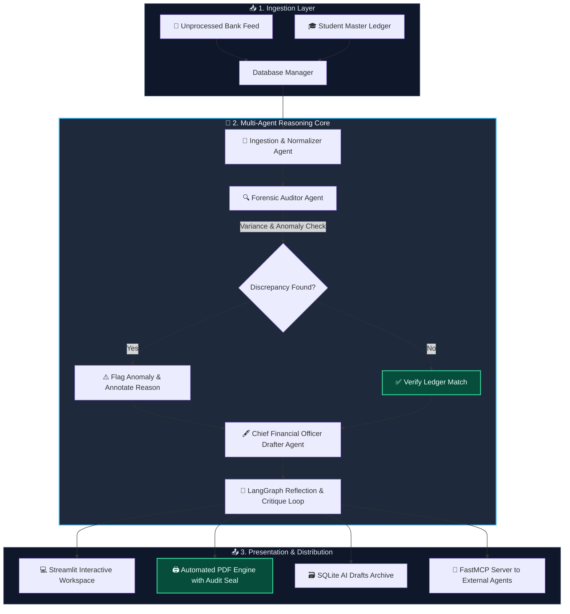

<div align="center">

# 🛡️ EduFinance Drafting Agent Pro
### *Autonomous Multi-Agent Financial Reconciliation & Executive Document Drafting Platform*

[](https://www.python.org/)
[](https://streamlit.io/)
[](https://groq.com/)
[](https://modelcontextprotocol.io/)
[](LICENSE)
[](CONTRIBUTING.md)

<p align="center">
  <b>Transforming messy university bank feeds into audit-certified financial reconciliations, approval memos, and executive PDF reports with sub-second AI reasoning.</b>
</p>

[✨ Key Features](#-key-features) •
[🏗️ Architecture](#-system-architecture) •
[🚀 Quick Start](#-quick-start) •
[🔌 FastMCP Server](#-model-context-protocol-mcp-integration) •
[📊 Dashboard Tour](#-dashboard-workspace-tour) •
[📂 Project Structure](#-project-structure) •
[🗺️ Roadmap](#-roadmap)

---

</div>

## 📌 Problem & Solution

Financial reconciliation in educational institutions and enterprise accounting is notoriously tedious, error-prone, and slow:
* **The Problem**: Bank transaction descriptions are truncated and cryptic (e.g., `ALICE J - Q1 FEES`, `V. KUMAR / STUDENT FEE`), while student ledger databases contain separate IDs and outstanding fee amounts. Manual cross-referencing leads to reconciliation backlog, compliance risks, and delayed audits.
* **The Solution**: **EduFinance Drafting Agent Pro** coordinates specialized autonomous agents:
  1. **Ingestion & Normalizer Agent**: Resolves noisy bank feed records to student master ledgers.
  2. **Forensic Auditor Agent**: Detects variance anomalies, partial payments, overpayments, and compliance flags.
  3. **Executive Drafter Agent (CFO Tone)**: Formulates formal, audit-ready reconciliation memos and executive briefs.
  4. **PDF Publishing Engine**: Converts drafts into branded, timestamped official institution PDFs with verification seals.

---

## ✨ Key Features

| Feature | Description |
| :--- | :--- |
| 🤖 **Autonomous Multi-Agent Loop** | 2-Phase and LangGraph iterative pipelines separating reasoning & data forensics from executive drafting. |
| ⚡ **Groq Ultra-Fast Inference** | Powered by high-parameter reasoning models (`openai/gpt-oss-120b` & `llama-3.3-70b`) with high reasoning effort. |
| 🔍 **Explainable AI (XAI) Forensic Trace** | Transparent step-by-step reasoning audit logs showing ingestion, fuzzy identity resolution, and variance checks. |
| 📄 **One-Click Official PDF Generation** | Dynamic A4 PDF engine with header logos, institutional metadata, and authorized AI verification signatures. |
| 🔌 **FastMCP Protocol Server** | Standard Model Context Protocol (`mcp_server.py`) allowing external tools (Claude Desktop, Cursor) to query ledger data. |
| 📊 **Operational Analytics Suite** | Real-time Plotly charts tracking drafting volume by purpose, generation velocity, and subsystem health uptime. |
| 🗄️ **Persistent SQLite Audit Trail** | Embedded database storing student records, unhandled bank feeds, and generated historical drafts. |

---

## 🏗️ System Architecture



---

## 🚀 Quick Start

### 1. Prerequisites
- **Python**: 3.10 or higher
- **Groq API Key**: [Get a free Groq API Key here](https://console.groq.com/keys) (or Google Gemini API Key)

### 2. Clone the Repository
```bash
git clone https://github.com/Mukesh631102/Drafting-agent.git
cd Drafting-agent
```

### 3. Create & Activate a Virtual Environment
```bash
# Windows
python -m venv venv
.\venv\Scripts\activate

# macOS / Linux
python3 -m venv venv
source venv/bin/activate
```

### 4. Install Dependencies
```bash
pip install -r requirements.txt
```

### 5. Configure Environment Variables
Copy `.env.example` to `.env` and fill in your API key:
```bash
cp .env.example .env
```
Edit `.env`:
```env
GROQ_API_KEY=gsk_your_groq_api_key_here
GROQ_MODEL_ID=openai/gpt-oss-120b
```

### 6. Seed the Demo Database
Initialize SQLite with student profiles and real-world messy bank feeds:
```bash
python seed_db.py
```

### 7. Launch the Dashboard
```bash
streamlit run app.py
```
Your browser will automatically open at `http://localhost:8501`.

---

## 🔌 Model Context Protocol (MCP) Integration

The project includes an enterprise-ready FastMCP server (`mcp_server.py`) exposing financial tools to desktop AI agents (e.g., Claude Desktop, Cursor, Cline).

### Running the MCP Server
```bash
python mcp_server.py
```

### Claude Desktop Configuration (`claude_desktop_config.json`)
```json
{
  "mcpServers": {
    "edufinance": {
      "command": "python",
      "args": ["/absolute/path/to/Drafting-agent/mcp_server.py"],
      "env": {
        "PYTHONIOENCODING": "utf-8"
      }
    }
  }
}
```

---

## 📊 Dashboard Workspace Tour

### 1. 🚀 Drafting Workspace
* **Workflow Selector**: Switch between *Reconciliation*, *Financial Report*, and *Approval Memo*.
* **Data Sources**: Direct Database Sync against unprocessed bank feeds or Manual JSON payload testing.
* **Forensic Reasoner**: Live execution progress showing data normalization, variance checks, and CFO drafting.
* **Dual Preview**: Markdown executive summary + Instant Download of official branded PDF.

### 2. 📜 Audit History
* Searchable and filterable archive of all historical AI-generated drafts.
* Full transparency: inspect generated text, status, and reflection prompts anytime.

### 3. 📊 Intelligence Dashboard
* **Volume Distribution**: Pie chart breakdown of drafts generated by workflow type.
* **Velocity Metrics**: Real-time generation throughput analysis.
* **Subsystem Health Monitor**: Live status tracking for LLM Drafter, Rule Auditor, Database Connector, and PDF Kernel.

---

## 📂 Project Structure

```text
Drafting-agent/
├── 📁 api/                      # Optional REST API endpoint extensions
├── 📁 data/                     # Sample memos, raw markdown test data & prompts
├── 📁 frontend/                 # Alternate LangGraph chat-style Streamlit client
├── 📁 src/
│   ├── 📁 agents/               # Multi-agent implementations
│   │   ├── drafting_agent.py    # 2-Phase Groq Reasoning & Drafting controller
│   │   ├── researcher.py        # Web & query research agent
│   │   ├── writer.py            # Primary document authoring agent
│   │   ├── editor.py            # Critique & compliance feedback agent
│   │   └── orchestrator.py      # Multi-agent coordinator
│   ├── 📁 brain/                # LLM connectivity & LangGraph state machine
│   │   ├── llm_client.py        # Groq client wrapper with reasoning configuration
│   │   ├── flow.py              # LangGraph state machine definition
│   │   └── state.py             # AgentState schema definitions
│   ├── 📁 memory/               # Vector store & memory abstractions
│   ├── 📁 templates/            # Prompt templates (Reconciliation, Memos, Reports)
│   ├── 📁 tools/                # File I/O, draft writer, and search utilities
│   ├── 📁 utils/                # Configuration & environment loaders
│   └── database_mgr.py          # SQLite database interface & schema definitions
├── .env.example                 # Sanitized environment variable template
├── .gitignore                   # Comprehensive Python & OS ignore rules
├── app.py                       # Main production Streamlit enterprise dashboard
├── CONTRIBUTING.md               # Guidelines for open-source contributors
├── LICENSE                      # MIT Open Source License
├── logo.png                     # Institution logo for generated PDF reports
├── main.py                      # CLI runner for quick agent execution
├── mcp_server.py                # Model Context Protocol server (FastMCP)
├── requirements.txt             # Project dependencies
└── seed_db.py                   # Database seeder with realistic test datasets
```

---

## 🛠️ Technology Stack

* **LLM Engine**: [Groq](https://groq.com/) (GPT OSS 120B / Llama 3.3 70B) & [Google Gemini](https://ai.google.dev/)
* **Multi-Agent Orchestration**: [LangGraph](https://github.com/langchain-ai/langgraph) / Custom Multi-Phase Reasoning Pipeline
* **Frontend**: [Streamlit](https://streamlit.io/) with custom dark slate styling & [Plotly](https://plotly.com/)
* **Database**: [SQLite](https://sqlite.org/) with [Pandas](https://pandas.pydata.org/)
* **PDF Kernel**: [FPDF2](https://py-pdf.github.io/fpdf2/) with Latin-1 normalization and automatic letterhead layouts
* **Interoperability**: [FastMCP](https://github.com/jlowin/fastmcp) (Model Context Protocol)

---

## 🗺️ Roadmap

- [x] Multi-Agent reasoning & drafting pipeline
- [x] Streamlit live dashboard with XAI forensic trace
- [x] Automatic institutional PDF generation
- [x] FastMCP server integration for external agents
- [ ] OCR engine for direct bank receipt and invoice image ingestion
- [ ] Multi-tenant role-based access control (Admin, Auditor, Drafter)
- [ ] Export directly to Google Docs & Microsoft Word (.docx)
- [ ] Real-time webhooks for automated ERP banking notifications

---

## 🤝 Contributing

Contributions are warmly welcomed! Please read the [Contributing Guidelines](CONTRIBUTING.md) to get started.

---

## 📄 License

Distributed under the **MIT License**. See [LICENSE](LICENSE) for more information.

---

<div align="center">
  <sub>Built with ❤️ by <a href="https://github.com/Mukesh631102">Mukesh</a> and open-source contributors. If you find this project helpful, please give it a ⭐ on GitHub!</sub>
</div>
